# Watson Assistant Security - Instructions

I made this based on IBM's **Watson Assistant Documentation**, click [here](https://cloud.ibm.com/docs/watson-assistant?topic=watson-assistant-web-chat-security-enable) to learn more about it.

**Requirements to start:**

- Watson Assistant Instance
- A Assistant configured

Assuming that you already have an **Watson Assistant** configured, followed those steps above:

1. Open your terminal and then type:
   `git clone https://github.com/miucciaknows/Watson-Assistant-WebSecurityPage`

2. Now you're going to access you directory:

`cd WatsonAssistant-Security/keys`

3. Open your terminal and then type:
   `openssl genrsa -out key.pem 2048`

Go to HTML code and provide your: **integrationID. // The ID of this integration.**
 

**region: "", // The region your integration is hosted in.**
 

**serviceInstanceID: // The ID of your service instance.**

All this information can be found in your **Watson's Assistant Instance**, follow the images above to get it:

This will provide you a **private key.**

**Now:**

1. Go to your **Watson's Assistant Instance on IBM's Cloud.**

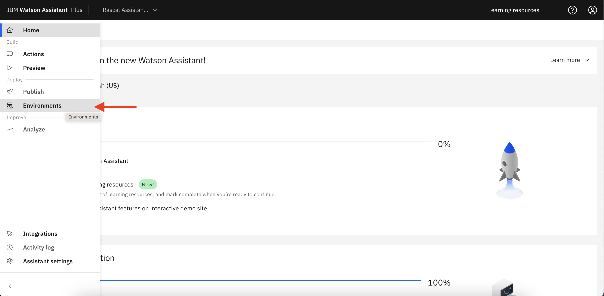

2. Click on **Environments tab**, it's on left side of screen.

On the same page, click in **website tab**

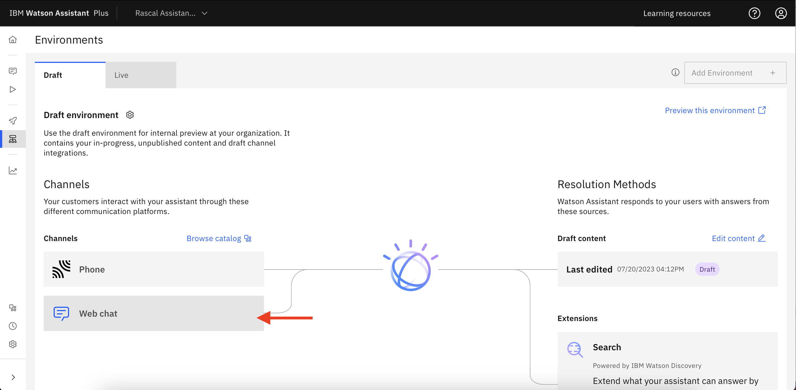

3. go to **Embed** tab

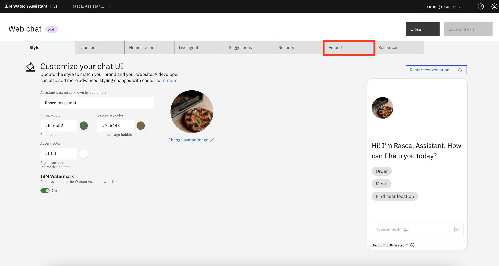

4. Copy your credentials and then, click on **security** tab.

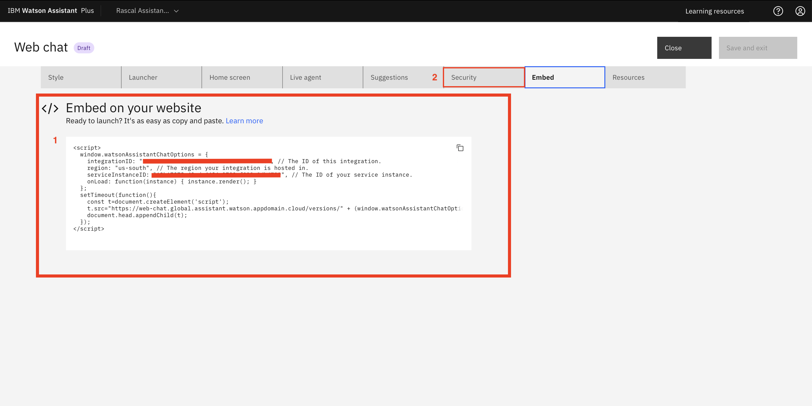

5. **Enable security into your Assistant.**

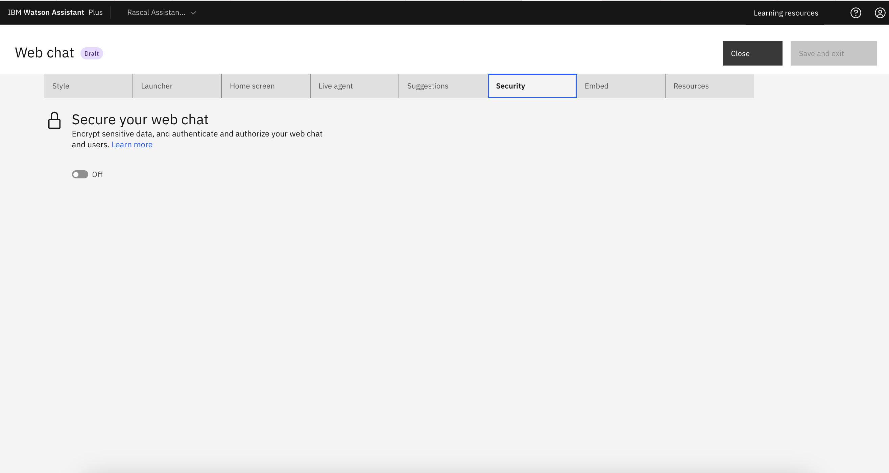

6. Copy all your **public key and store** in a safe place.

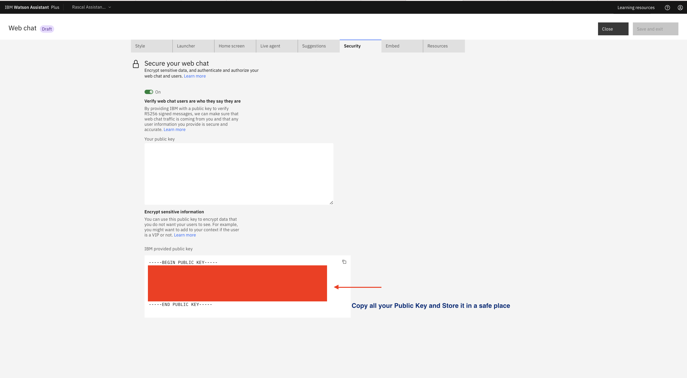

7. Then paste your key that you created, with `openssl genrsa -out key.pem 2048` command.

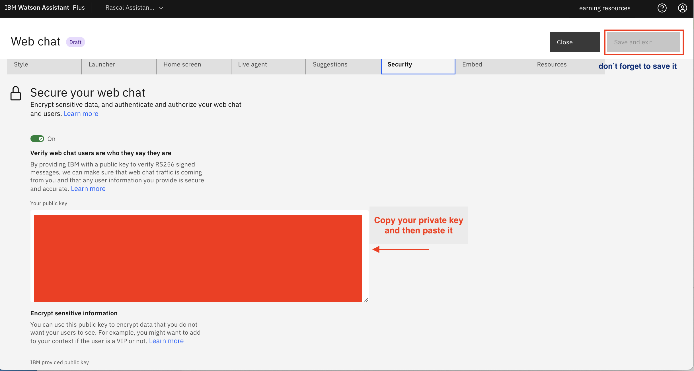

Now it's time to open your project again (I'm using Visual Studio to code this project)

Take the credentials that you copy in **step 4** and paste then in **html file:**

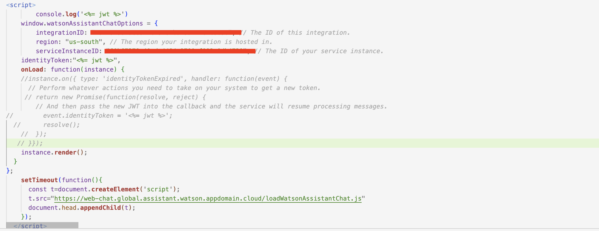

Take **the public key** and you created in **step 6** and now paste into a file **key.pub**

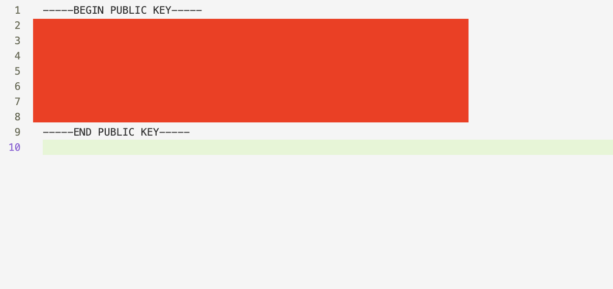

-> Keep your **public key** and your **private key** in the **/keys** directory.

In your terminal:

1. Run `npm install`

2. Start the Node.js server `nodemon` or `node server.js`

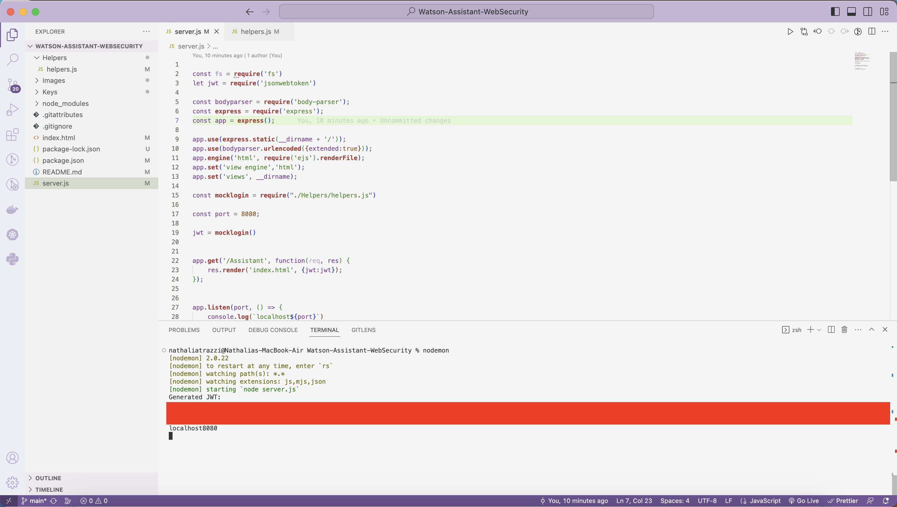

3. Open a brownser and type: `localhost:8080/token`

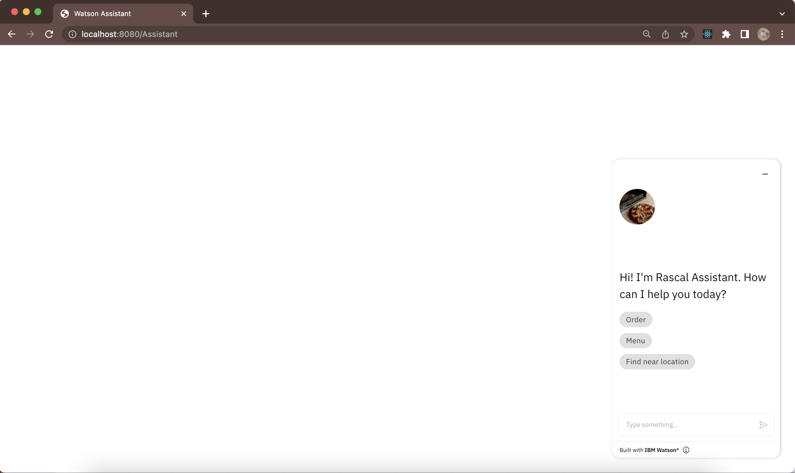

4. Then go to: `localhost:8080/Assistant`

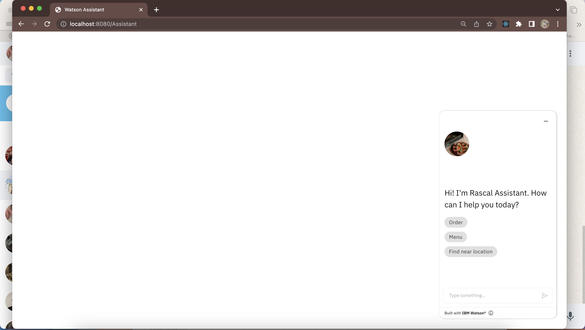

5. Click on the chatbot icon on the bottom right.
